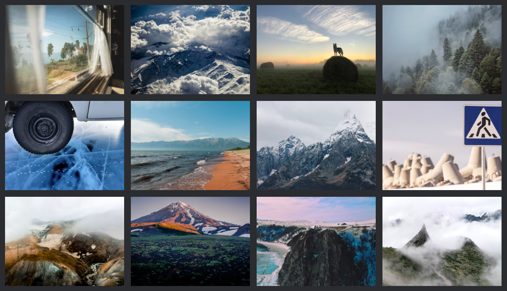

# Проект: Путешествие по России

## На этом сайте читатель найдет для себя:

    Интересные места России, достойные вашего отпуска
    Что есть в Калининградской области, Алтае, Карелии, на Байкале и Кольском полуострове
    Как доехать до Байкала «на собаках»
    Вдохновляющие фотографии

____

**Технологии**

* Адаптивная верстка (для ширины дисплея 320px, 768px, 1024px и 1280px)
* Медиазапросы
* Grid-сетки
* Flex
* Сглаживание, рендеринг шрифтов, подгонка размера текста
* Немного JS

____

**To Do**

&nbsp; :white_medium_small_square: &nbsp;Добавить англоязычную версию
____
**GitHub Pages:** [Russian Travel](https://anastasiapovarkova.github.io/russian-travel/)
